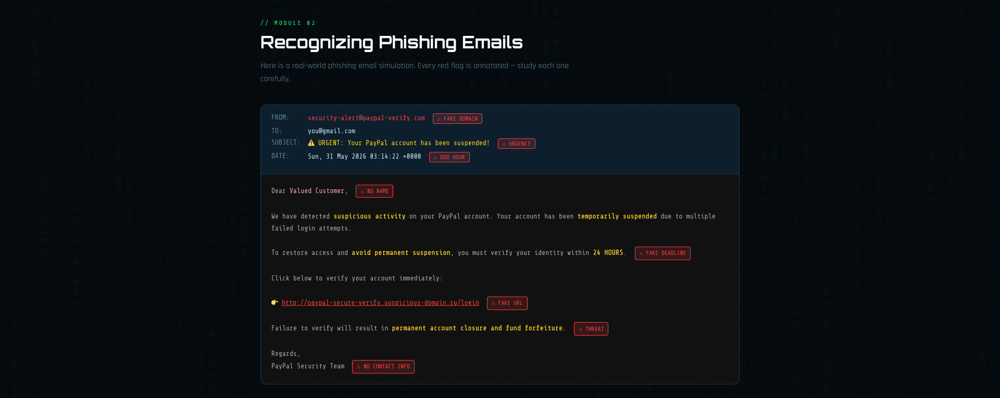
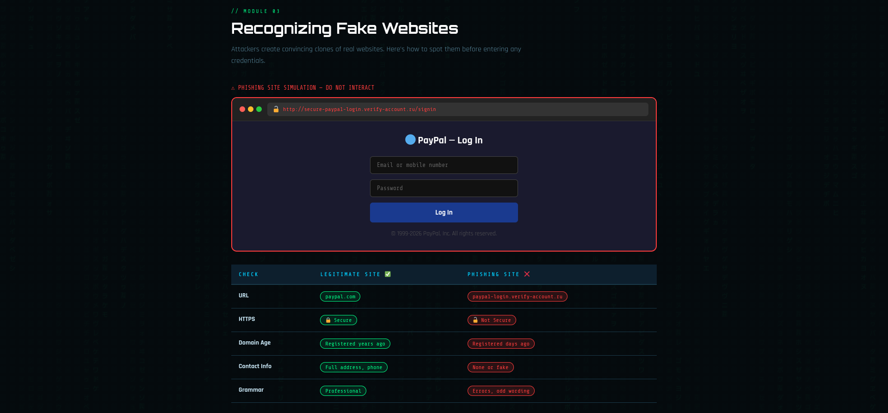

# 🎣 Phishing Awareness Training — CodeAlpha Internship Task 2

<p align="center">
  
  
  
  
  
</p>

<p align="center">
  A fully interactive, browser-based Phishing Awareness Training module built with HTML, CSS, and JavaScript. Features 6 educational modules, real-world phishing simulations, social engineering tactics, best practices — and ends with a personalized quiz and certificate.
</p>
---

## 📸 Modules Preview




---

## 📌 About This Project

This project was built as **Task 2** of the **CodeAlpha Cybersecurity Internship**.

**Objective:** Create an interactive training module that educates users about:
- What phishing attacks are and their different types
- How to recognize phishing emails and fake websites
- Social engineering tactics used by attackers
- Best practices and actionable tips to stay safe
- Testing knowledge through an interactive quiz

> ⚠️ **Disclaimer:** All phishing examples shown in this module are simulated for educational purposes only. No real credentials are collected.

---

## ✨ Features

| Feature | Description |
|--------|-------------|
| 🔐 **Personalized Experience** | Enter your name at start — displayed in header, score report, and certificate |
| 🌧️ **Matrix Rain Animation** | Animated background for authentic cybersecurity aesthetic |
| 📊 **Progress Tracker** | Sticky progress bar and navigation dots showing current module and completion % |
| 📧 **Phishing Email Simulation** | Annotated fake email with 6 red flags highlighted inline |
| 🌐 **Fake Website Demo** | Simulated phishing login page with browser URL bar analysis |
| 🧠 **Social Engineering Tactics** | 5 real tactics with real-world example scripts |
| ✅ **Best Practices Checklist** | 7 actionable practices + quick-reference security checklist |
| 🎯 **Interactive Quiz** | 6 questions with instant feedback, explanations, and score tracking |
| 🏆 **Certificate of Completion** | Personalized badge with name and final score |
| 🔄 **Restart Functionality** | Full reset — clears name, quiz, and score for a fresh attempt |
| 📱 **Responsive Design** | Works on desktop, tablet, and mobile browsers |
| 🚫 **No Dependencies** | Pure HTML/CSS/JS — no internet required, opens with a double-click |

---

## 🗂️ Module Breakdown

### Module 01 — What is Phishing?
Introduces phishing as a concept and covers all 6 major attack types:

| Type | Description |
|------|-------------|
| 📧 Email Phishing | Fraudulent emails impersonating trusted brands |
| 📱 Smishing (SMS) | Phishing via text messages and fake OTP alerts |
| 📞 Vishing (Voice) | Phone call scams impersonating banks or government |
| 🎯 Spear Phishing | Targeted attacks personalized using victim's data |
| 🐋 Whaling | High-value targets — CEOs, CFOs, C-suite executives |
| 🌐 Pharming | DNS-based redirect to fake sites even on correct URL |

> **Real World Example:** 2022 Uber breach — attacker used WhatsApp MFA fatigue attack to gain full internal network access.

---

### Module 02 — Recognizing Phishing Emails
A fully annotated **live phishing email simulation** showing all red flags:

| Red Flag | What to Look For |
|----------|-----------------|
| 🔴 Fake Domain | `paypa1.com` — letter "l" replaced with number "1" |
| ⏰ Artificial Urgency | "24 HOURS", "immediate action", "permanent suspension" |
| 👤 Generic Greeting | "Dear Valued Customer" — no real name used |
| 🔗 Suspicious URL | Ends in `.ru`, contains random words, not the official domain |
| 🕐 Odd Send Time | Emails sent at 3 AM from overseas servers |
| ⚠️ Threats | "Fund forfeiture", "legal action", "permanent closure" |

> **Pro Tip:** Always hover over links before clicking — check the actual URL shown at the bottom-left of your browser.

---

### Module 03 — Recognizing Fake Websites
A **simulated phishing login page** (PayPal clone) with full browser bar analysis:

| Check | Legitimate Site ✅ | Phishing Site ❌ |
|-------|-------------------|-----------------|
| URL | `paypal.com` | `paypa1-login.verify-account.ru` |
| HTTPS | 🔒 Secure connection | 🔓 Not secure |
| Domain Age | Registered years ago | Registered days/hours ago |
| Contact Info | Full address and phone number | None or fake |
| Grammar | Professional, error-free | Spelling mistakes, odd phrasing |

> **Tools to Verify:** `whois.domaintools.com` for domain age · `virustotal.com` to scan suspicious URLs against 70+ security engines.

---

### Module 04 — Social Engineering Tactics
Covers 5 psychological manipulation tactics used by attackers:

| Tactic | How It Works | Real Example Script |
|--------|-------------|---------------------|
| 😱 Fear & Urgency | Creates panic, bypasses rational thought | "Your account will be deleted in 24 hours" |
| 🎁 Greed & Reward | Promises prizes, lottery wins, government funds | "You have been selected for ₹50,000 COVID Relief" |
| 🤝 Authority & Trust | Impersonates police, bank officials, IT dept | "This is the CBI Cyber Crime Division..." |
| 💕 Romance & Friendship | Builds emotional bonds over weeks before asking for money | "I am a US soldier, I need ₹5000 to get emergency leave" |
| 🆘 Pretexting | Fabricated scenario to extract credentials | "IT audit — we need your password to verify your account" |

> **Golden Rule:** No legitimate bank, government agency, or tech company will EVER ask for your password, OTP, PIN, or CVV — under any circumstances.

---

### Module 05 — Best Practices & Protection
7 actionable security practices:

1. **Enable Multi-Factor Authentication (MFA)** — Use an authenticator app (Google Authenticator/Authy), not SMS-based OTP
2. **Verify Before You Click** — Hover links, navigate directly to websites manually by typing in the browser
3. **Use a Password Manager** — Auto-fills only on correct domains, instantly blocks fake phishing sites
4. **Keep Software Updated** — Browser updates include phishing site blacklists automatically
5. **Report Suspicious Emails** — Use "Report Phishing" in Gmail or "Report Message" in Outlook
6. **Check Email Headers** — Verify SPF, DKIM, DMARC via "Show Original" in Gmail to confirm sender identity
7. **Educate Your Team / Family** — The weakest link is always human; one untrained person can compromise everyone

**Quick Reference Checklist:**
- ✓ Verify the sender's email domain before responding
- ✓ Hover over links — check the actual URL destination
- ✓ Look for HTTPS 🔒 and verify the exact domain spelling
- ✓ Never share OTP, password, or CVV over call / SMS / email
- ✓ Use MFA on all important accounts
- ✓ When in doubt — call the company directly on their official number
- ✓ Check `virustotal.com` for any suspicious links or files

---

### Module 06 — Interactive Quiz
6 knowledge-check questions covering all modules:

| # | Topic Tested | Concept |
|---|-------------|---------|
| Q1 | Phishing Email | Recognizing a fake domain and taking the correct action |
| Q2 | URL Safety | Identifying the only safe URL among 4 lookalike options |
| Q3 | Social Engineering | Handling credential requests over a phone call |
| Q4 | Attack Types | Identifying Whaling vs Smishing, Spear Phishing, Pharming |
| Q5 | HTTPS Misconception | Understanding what the padlock icon actually means |
| Q6 | Best Protection | Identifying MFA as the strongest single defense |

**Scoring System:**

| Score | Badge | Message |
|-------|-------|---------|
| 6 / 6 | 🏆 | Perfect Score — You are a Phishing Expert! |
| 4 – 5 / 6 | ✅ | Great Job — Solid phishing awareness |
| 2 – 3 / 6 | ⚠️ | Good Effort — Review the modules and retry |
| 0 – 1 / 6 | ❌ | Please go through the training again carefully |

After completing the quiz, a **personalized certificate** is displayed showing:
- The user's name (entered at the start)
- Their final score (e.g. `5 / 6`)
- Module completion status

---

## 🚀 How to Run

No installation or internet connection required:

```bash
# Option 1 — Double click
# Simply double-click phishing_awareness.html in your file manager

# Option 2 — From terminal (Linux/Kali)
xdg-open phishing_awareness.html

# Option 3 — From terminal (macOS)
open phishing_awareness.html
```

Works in any modern browser: **Chrome, Firefox, Edge, Brave, Safari**

---

## 🗂️ Project Structure

```
CodeAlpha_Phishing_Awareness/
│
├── phishing_awareness.html     # Complete self-contained training module
├── README.md                   # This file
│
└── screenshots/
    ├── name_entry.png          # Name input screen
    ├── module_view.png         # Module layout example
    ├── phishing_email.png      # Phishing email simulation
    ├── fake_website.png        # Fake website demo
    ├── quiz.png                # Quiz with instant feedback
    └── certificate.png         # Personalized completion certificate
```

---

## 🔬 How It Works (Technical Flow)

```
User opens phishing_awareness.html
        │
        ▼
  Name Entry Screen  ──── enters name ────▶  Training Begins
                                                    │
                    ┌───────────────────────────────┤
                    │                               │
              7 Sections                    Progress Bar
          (navigated via                  updates each step
         buttons or dots)
                    │
        ┌───────────┴────────────────────────────────────┐
        │           │           │          │             │
   Section 0   Section 1   Section 2  Section 3    Section 4
  What is      Phishing    Fake       Social       Best
  Phishing     Email Sim   Website    Engineering  Practices
                    │
               Section 5 (Quiz)
          6 Questions → Instant Feedback
          Score tracked in JS object
                    │
               Section 6 (Certificate)
          userName + finalScore displayed
          Badge rendered dynamically
                    │
               Restart Button
          Clears all state → Name Screen
```

---

## 🛡️ If You Think You've Been Phished

1. **Change your password** immediately on the real website
2. **Enable MFA** on the account right away
3. **Check for unauthorized activity** — transactions, emails sent, logins from unknown devices
4. **Report to your bank or IT team** as soon as possible
5. **Report the phishing site** to Google Safe Browsing:
   `https://safebrowsing.google.com/safebrowsing/report_phish`

---

## 🧰 Technologies Used

| Technology | Purpose |
|-----------|---------|
| **HTML5** | Structure, sections, quiz elements |
| **CSS3** | Dark cybersecurity theme, card animations, responsive layout |
| **Vanilla JavaScript** | Quiz logic, navigation, score tracking, dynamic name/certificate |
| **Canvas API** | Matrix rain background animation |
| **Google Fonts** | Orbitron (headings), Rajdhani (body), Share Tech Mono (code/labels) |

---

## 📚 What I Learned

- How phishing attacks are structured and why they are psychologically effective
- The difference between email phishing, smishing, vishing, spear phishing, whaling, and pharming
- Why HTTPS alone does not make a website safe — free SSL certificates are available to anyone
- How social engineering exploits human psychology rather than technical vulnerabilities
- Building multi-section interactive web modules with pure HTML/CSS/JavaScript
- Designing educational content for cybersecurity awareness training

---

## 👨‍💻 Developer

**Priyan**
CodeAlpha Cybersecurity Internship — Task 2

---

## 📜 License

This project is for **educational purposes only** as part of the CodeAlpha internship program.

> All phishing simulations shown are fictional and created solely for awareness training. No real credentials are collected or stored at any point.
